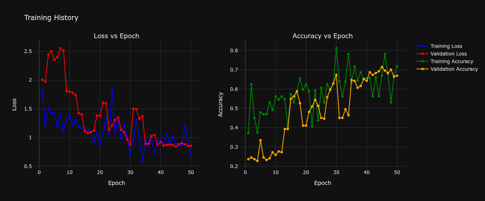
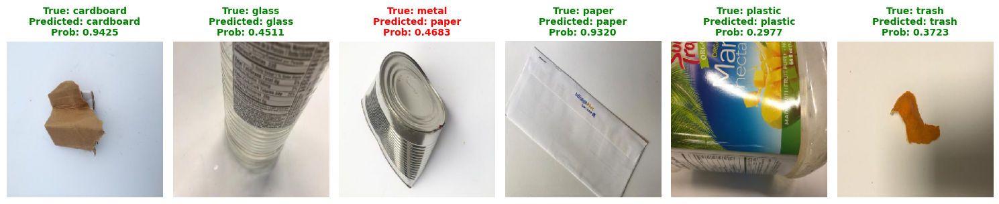
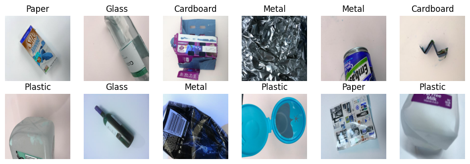

# Garbage Classification Using CNN

## Overview

Proyek ini bertujuan untuk mengklasifikasikan jenis sampah menggunakan **Convolutional Neural Network (CNN)**. Model dilatih untuk mengenali beberapa kategori sampah sehingga dapat membantu proses pemilahan sampah secara otomatis dan mendukung sistem pengelolaan limbah yang lebih efisien.

## Dataset

Dataset yang digunakan:

**Trash Type Image Dataset**
https://www.kaggle.com/datasets/farzadnekouei/trash-type-image-dataset

Dataset ini terdiri dari **2.527 gambar** dengan **6 kelas sampah**, yaitu:

- Cardboard
- Glass
- Metal
- Paper
- Plastic
- Trash

Spesifikasi dataset:

- Total Images: 2.527
- Format: JPEG
- Resolusi: 512 × 384 pixel

Sumber: Farzad Nekouei (Kaggle)

---

## Model Architecture

Model yang digunakan adalah Convolutional Neural Network (CNN) yang terdiri dari:

- Convolution Layer
- Max Pooling Layer
- Dropout Layer
- Fully Connected Layer
- Softmax Output Layer

Framework yang digunakan:

- Python
- TensorFlow / Keras
- NumPy
- Matplotlib
- Scikit-Learn

---

## Project Structure

```text
Garbage-Classification-CNN/
│
├── Main.ipynb
├── README.md
│
└── output/
    ├── Confusion Matrix.png
    ├── predict.png
    ├── training history plot.png
    └── visualisasi.png
```

---

## Training History

Visualisasi akurasi dan loss selama proses training.



---

## Sample Prediction

Contoh hasil prediksi model pada gambar uji.



---

## Confusion Matrix

Evaluasi performa model menggunakan confusion matrix.


---

## Data Visualization

Visualisasi beberapa sampel gambar dari dataset.



---

## Evaluation Metrics

Model dievaluasi menggunakan:

- Accuracy
- Precision
- Recall
- F1-Score
- Confusion Matrix

---

## How to Run

1. Clone repository

```bash
git clone https://github.com/username/Garbage-Classification-CNN.git
```

2. Install dependencies

```bash
pip install tensorflow numpy matplotlib scikit-learn
```

3. Jalankan notebook

```bash
jupyter notebook Main.ipynb
```